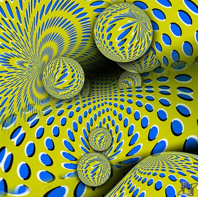
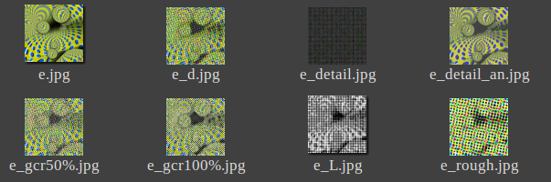
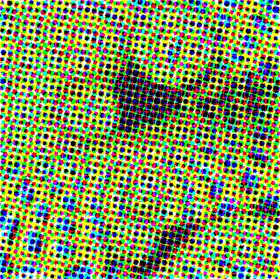
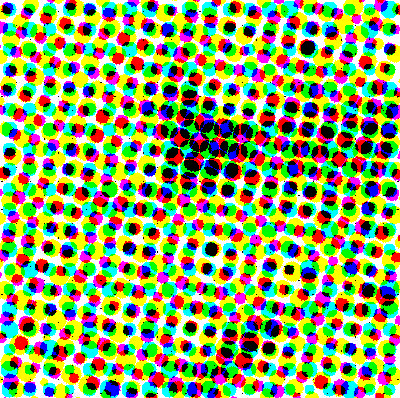
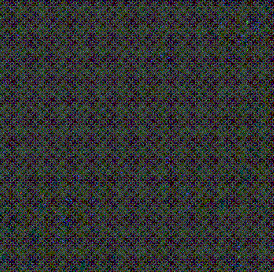
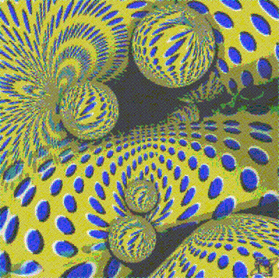
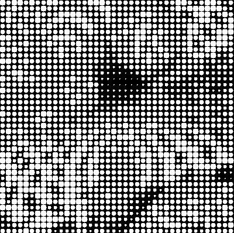
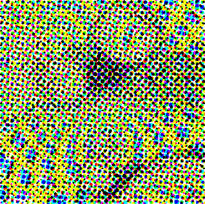
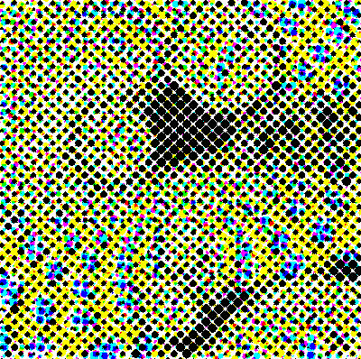

# Halftoning and QMC
## 各部分文件介绍

文件|说明
---|---
|src|markdown用到的图片|
|Halftone.py|仅Halftone technique 实现|
|main.py|Halftoning technique with Quasi-Monte Carlo integration algorithm(halton sequence) python code implement
|haltonSequence.py|halton sequence implement
| |
|halftone.md|Halftone technique 说明
|MC&QMC.md|MC & QMC 的学习笔记
|Pytest.md|pytest的学习笔记
|1_.png|供测试的图片

## main.py usage
这里暂时用`halftone.py`代替:
>envs:  python3.6  pillow 5.00 : well tested

```py
import halftone
h = halftone.Halftone('/path/to/image.jpg')
#h.make()
h.make(
    sample=5,
    scale=2,
    angles=[15, 75, 0, 45],
    antialias=True
    style='color'
    percentage=50,
    filename_add='_new',
)
```

参数说明见代码函数体内,因为我自己不懂图形学,所以无法透彻的解释
```py
    sample: Sample box size from original image, in pixels.
    scale: Max output dot diameter is sample*scale
    angles: A list of 4 angles that each screen channel should be rotated by
    style: 'color' or 'grayscale'
    antialias: true or false
    percentage: How much of the gray component to remove from the CMY channels
        and put in the K channel
    filename_add: output filename
```
## 单元测试
`pip install pytest-cov`
`pytest --cov-report=html --cov=halftone`

## 效果图
name|effect
---|---
origin|
thumbnail|
default|
Sample 20 |
Sample 2 |
Sample 2 antialias on |
grayscale |
GCR | 
