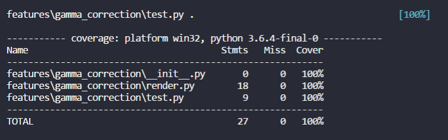

# 项目Gamma_correction

目录：

gamma_correction	---|--- README.md

​					    |--- render.py     #核心代码函数

​					    |--- test__render.py

​					    |--- \_\_init\_\_.py

具体过程描述：

- 读入图片rgb信息矩阵
- 选择用哪个处理函数来进行伽马校正
- 是否进行图片输出渲染
- 是否输出文件

测试用例使用统一python skimage包中自带的图片作为测试用例

- 用第一个处理函数 并 渲染 和输出文件
- 用第二个处理函数
- 用第三个处理函数

说明：

- 用pytest 测试时会渲染出结果图片 但会报精度下降的warning	
- 覆盖率为100%

- 

