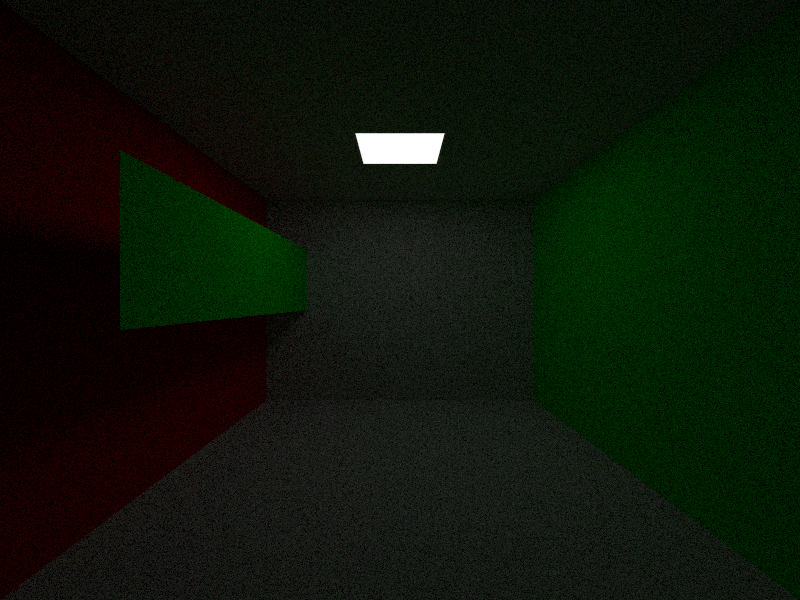
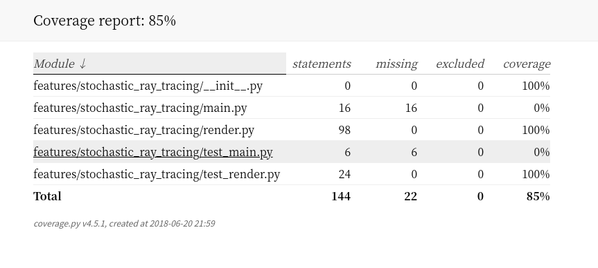

## A group stochastic ray tracing 
* 测试

    * 请在测试前重新安装一次`relaxrender`，因为需要安装我们的包
    * 建议忽略 main.py , 这个代码是主要渲染的结果， 耗时比较长
    
     `pytest --cov-report=html --cov=stochastic_ray_tracing --ignore=test_main.py`
* 代码
    * 我们修改了`forward_history`中的代码，为了调用我们提供的接口
* 效果

    

* 测试覆盖率

    